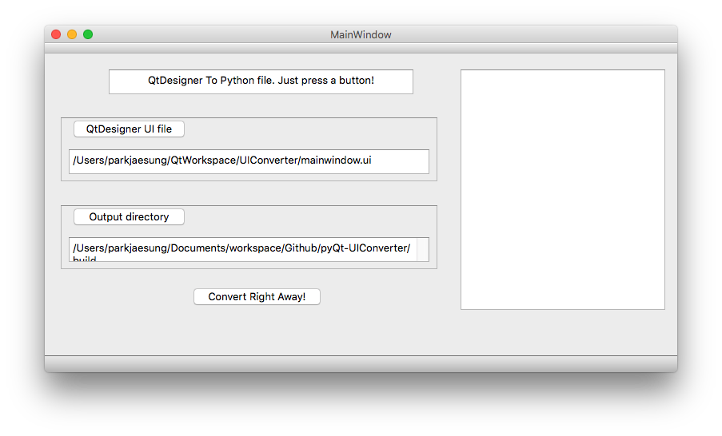

# pyQt-UIConverter

pyQt-UIConverter is a simple tool for converting Qtdesigner file(*.ui) to python file(*.py).

All you need to do is selecting ui file and selecting output directory.

All suggestion, opinion, pull requests are welcomed.

### How to Run

**Tested only on OSX**

You can execute convert.py directly, or download converter.pkg to run on OSX.

Window, Linux will be supported soon.

### How to build executable file

pyQt applications can be build to executable file by pyinstaller.

pyinstaller requires .spec file to generate executable file. /convert.spec file in this repository is for pyinstaller.

If you want to use pyinstaller for this application, you have to change the directories in convert.spec

Change pathex, datas value in below file. 

convert.spec)

~~~
# -*- mode: python -*-

block_cipher = None

a = Analysis(['convert.py'],
             pathex=['/Users/parkjaesung/Documents/workspace/Github/pyQt-UIConverter'],
             binaries=[],
             datas=[('/Users/parkjaesung/Documents/workspace/Github/pyQt-UIConverter/config/', 'config')],
             hiddenimports=[],
             hookspath=[],
             runtime_hooks=[],
             excludes=[],
             win_no_prefer_redirects=False,
             win_private_assemblies=False,
             cipher=block_cipher)
pyz = PYZ(a.pure, a.zipped_data,
             cipher=block_cipher)
exe = EXE(pyz,
          a.scripts,
          exclude_binaries=True,
          name='convert',
          debug=False,
          strip=False,
          upx=True,
          console=False , icon='ndowed')
coll = COLLECT(exe,
               a.binaries,
               a.zipfiles,
               a.datas,
               strip=False,
               upx=True,
               name='convert')
app = BUNDLE(coll,
             name='convert.app',
             icon='ndowed',
             bundle_identifier=None)

~~~

Then, run below command.

~~~
pyinstaller convert.spec
~~~

### Developer

* ParkJaesung
  * Korea Digital Media High School
  * email : jspark141515@gmail.com

> Developed by pyQt5

### License

MIT License

Copyright (c) 2017 ParkJaesung

Permission is hereby granted, free of charge, to any person obtaining a copy
of this software and associated documentation files (the "Software"), to deal
in the Software without restriction, including without limitation the rights
to use, copy, modify, merge, publish, distribute, sublicense, and/or sell
copies of the Software, and to permit persons to whom the Software is
furnished to do so, subject to the following conditions:

The above copyright notice and this permission notice shall be included in all
copies or substantial portions of the Software.

THE SOFTWARE IS PROVIDED "AS IS", WITHOUT WARRANTY OF ANY KIND, EXPRESS OR
IMPLIED, INCLUDING BUT NOT LIMITED TO THE WARRANTIES OF MERCHANTABILITY,
FITNESS FOR A PARTICULAR PURPOSE AND NONINFRINGEMENT. IN NO EVENT SHALL THE
AUTHORS OR COPYRIGHT HOLDERS BE LIABLE FOR ANY CLAIM, DAMAGES OR OTHER
LIABILITY, WHETHER IN AN ACTION OF CONTRACT, TORT OR OTHERWISE, ARISING FROM,
OUT OF OR IN CONNECTION WITH THE SOFTWARE OR THE USE OR OTHER DEALINGS IN THE
SOFTWARE.
